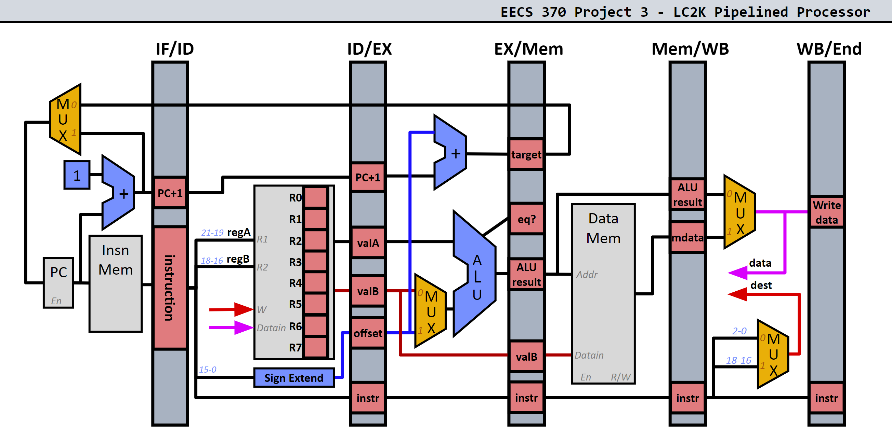
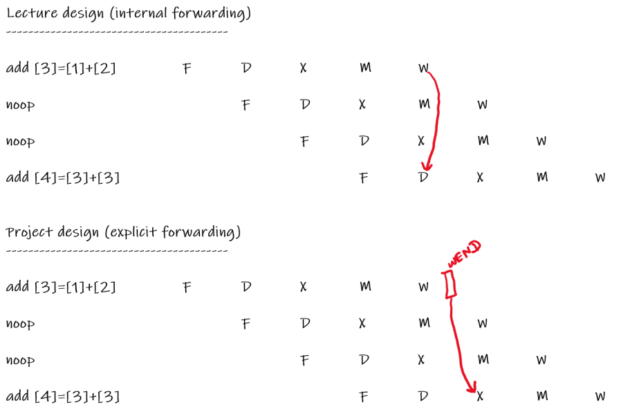

(proj descriptions and starter codes are not part of the license)

Project descriptions:

# Project 3 EECS 370 (Fall 2023)

| Worth:          | 100 Points                   | Points |
| --------------- | ---------------------------- | ------ |
| Assigned:       | Thursday, October 5th, 2023  |        |
| Checkpoint Due: | Thursday, November 2nd, 2023 | 5      |
| Due:            | Thursday, November 9th, 2023 | 95     |

# 0. Starter Code

[Starter code](https://eecs370.github.io/project_3_spec/starter_3.tar.gz) for project 3, the LC2K pipelined simulator.

| starter_3.tar.gz files | Description                                           |
| ---------------------- | ----------------------------------------------------- |
| Makefile               | Makefile to compile the project                       |
| p3spec.as              | Spec test case assembly file                          |
| p3spec.out.correct     | Correct pipelined simulator output for spec test case |
| starter_simulator.c    | Starter code for the LC-2K pipelined simulator        |

# 1. Purpose

This project is intended to help you understand in detail how a pipelined implementation works. You will write a *cycle-accurate* behavioral simulator for a pipelined implementation of the LC-2K, complete with data forwarding and simple branch prediction.

# 2. LC-2K Pipelined Implementation

## 2.1. Datapath



**Lecture Pipeline vs. Project 3 Pipeline**

*The lecture pipeline has internal forwarding for the register file, while the project 3 pipeline does not. This has the following implications:*

- For the project 3 pipeline, we add the `WBEND` pipeline register, after the write-back stage. This is because we do not have internal forwarding for the project 3 pipeline.
- For the project 3 pipeline, we will need to add 3 `noop` instructions to avoid data hazards instead of the 2 `noop` instructions needed for the lecture pipeline

On this note, the [pipeline simulator](https://eecs370.github.io/simulators/pipeline/) simulates the *lecture* pipeline instead of the project 3 pipeline.

You will use a clocking scheme mimicking real-life processors (e.g., register file and memory writes require the data to be present for the whole cycle).

## 2.2. `jalr`

You will not implement the `jalr` instruction from LC2K. Taking out `jalr` eliminates several dependencies. No submitted test cases should include `jalr`.

## 2.3. Memory

In the struct `stateStruct` there are two arrays representing memory: `instrMem` and `dataMem`.

Just like [project 1](https://eecs370.github.io/project_1_spec/), we can access memory directly as an array. The key difference from project 1 is the separation of data and instruction memory.

When the program starts, the starter code will read the machine-code file into **BOTH** `instrMem` and `dataMem` arrays (i.e., they will initially have the same contents).

During execution, you will need to fetch instructions from `instrMem` and perform load/stores using `dataMem`. That is, `instrMem` will never change after the program starts, but `dataMem` will change.

## 2.4. Pipeline Registers

For project 3, we provide structs representing various values held in the pipeline registers. You are required to use these pipeline register structs as `printState()` will print out their contents for grading.

Note that the instruction gets passed down the pipeline in its entirety.

You are free to add additional member variables, but **do not remove any member variables from the pipeline register structs**.

# 3. Problem

## 3.1. Basic Structure

Your task is to write a pipelined simulator for the LC-2K.

The starter code contains a `while` loop. Each iteration through the `while` loop executes one cycle:

- At the beginning of the cycle, the complete state of the machine is printed using `printState()`. Notice how `printState()` is passed the `state` variable. The `state` variable represents the current state of the processor.
- In the body of the loop, you will figure out what the new state of the machine (memory, registers, and pipeline registers) will be at the end of the cycle. In short, you will compute the `newState`, depending on the values found in `state`.
- At the end of the loop, we have the following statement: `state = newState`. This statement sets the current state of the processor, `state`, to the values we computed in `newState` during this cycle. This simulates the positive edge of the clock cycle.

**Specific guidelines for `state` and `newState`:**

`state` should **never** appear on the left-hand side of an assignment (except for array subscripts), and `newState` should **never** appear on the right-hand side of an assignment.

- **Reasoning for `state` and `newState`** :

Conceptually, all clocked components (pipeline registers, etc.) of a datapath compute their new states simultaneously with combinational logic. Since statements in C execute *sequentially* rather than *simultaneously*, you will need two state variables: `state` and `newState`. This is so we can mimic a clocking scheme used by real processors.

- **How to use `state` and `newState`**:

Each stage of the pipeline will modify the `newState` variable using the current values in the `state` variable. In the body of the loop, you will use `newState` only as the target of an assignment and you will use `state` only as the source of an assignment (e.g.,` newState... = state...`). For example, in the ID stage, you might have the following statement:

```
newState.IDEX.instr = state.IFID.instr //transfer the instruction in the IFID register to the IDEX register
```

Your simulator must be pipelined. This means that the work of carrying out an instruction should be done in different stages of the pipeline as described in lecture. The execution of multiple instructions should be overlapped. The ID stage should be the only stage that reads the register file; the other stages must get the register values from a pipeline register. If it violates these criteria, your project will not pass any test cases.

At the start of the program, initialize the pc and all registers to zero. Initialize the instruction field in all pipeline registers to the `noop` instruction (`0x1c00000`). A `noop` must travel through the pipeline, even though it has no effect on the state of the pipeline.

The easiest way to start is to first write your simulator so that it does not account for data or branch hazards. This will allow you to get started right away. Of course, the simulator will only be able to correctly run assembly-language programs that have no hazards. It is thus the responsibility of the assembly-language programmer to insert noop instructions so that there are no data or branch hazards. This strategy is called ***avoidance\***. This will require putting `noop`s in assembly-language programs after a branch and a number of `noop`s in an assembly-language program before a dependent data operation. (It is a good exercise to figure out the minimum number needed in each situation.) Keep in mind that the project checkpoint tells you if you are passing cases that avoid hazards (specifically, by removing all branches and by inserting `noop`s for data dependencies). Then you can finish your implementation by accounting for [data hazards](https://eecs370.github.io/project_3_spec/#33-data-hazards) and [control hazards](https://eecs370.github.io/project_3_spec/#34-control-hazards)

## 3.2. Halting

At what point does the pipelined computer know to stop? It’s incorrect to stop as soon as a `halt` instruction is fetched because if an earlier branch was actually taken, then the `halt` would be squashed.

In the example below, `beq 0 0 start` will always branch to the `start` label. However, the `halt` instruction will enter our pipeline, as we don’t resolve branches until the MEM stage.

Example demonstrating a taken branch causing a halt to be squashed 

|      | start   ...                   |
| ---- | ----------------------------- |
|      | beq     0       0       start |
|      | done    halt                  |
|      |                               |

To solve this problem, the starter code stops when the `halt` instruction reaches the `MEMWB` register. This ensures that previously executed instructions have completed, and it also ensures that the machine won’t branch around this `halt` instruction. Note how the final `printState()` call will print the final state of the machine before the check for a `halt` instruction.

## 3.3 Data Hazards

There are two types of data hazards that will need to be handled:

1. Data hazards that do not involve stalling, and can be resolved using data forwarding.
2. Data hazards that involve stalling, and still need forwarding

## 3.3.1 Data hazards that do not involve stalls

Use data forwarding to resolve most data hazards. The ALU should be able to take its inputs from any pipeline register (instead of just the `IDEX` register). To account for a lack of internal forwarding within the register file, you’ll instead forward data from the new `WBEND` pipeline register. Remember to take the most recent data (e.g., data in the `EXMEM` register gets priority over data in the `MEMWB` register). **ONLY FORWARD DATA TO THE EX STAGE (not to memory)**.

Here is an example demonstrating how forwarding is done:

Example demonstrating 1 instance of forwarding

|      | start   ...                         //Earlier code has loaded register 1 with a non-zero value. |
| ---- | ------------------------------------------------------------ |
|      | nor     1       1       2                                    |
|      | add     2       2       4                                    |
|      | done    halt                                                 |
|      | five    .fill 5                                              |
|      |                                                              |

| Pipe Trace  | Cycle 0 | Cycle 1 | Cycle 2 | Cycle 3 | Cycle 4 | Cycle 5 | Cycle 6 | Cycle 7 |
| ----------- | ------- | ------- | ------- | ------- | ------- | ------- | ------- | ------- |
| `nor 1 1 2` | IF      | ID      | EX      | MEM     | WB      |         |         |         |
| `add 2 2 4` |         | IF      | ID      | EX      | MEM     | WB      |         |         |

We require forwarding to resolve this data hazard. At cycle 2, when `add 2 2 4` is in the `ID` stage, `add 2 2 4` will read a *stale* value from the register file for register 2. The actual value `add 2 2 4` should use for register 2 is the value computed by `nor 1 1 2`, as it has the most up to date value for register 2. However, `nor 1 1 2` will not write to the register file until cycle 4, which is too late for `add 2 2 4`, as will read from the register file at cycle 2.

In order to compute the correct value, `add 2 2 4` will get the the correct value for register 2 from the `MEM` stage, since at cycle 3, `add 2 2 4` is in the `EX` stage, and `nor 1 1 2` is in the `MEM` stage.

## 3.3.2 Data hazards that involve stalls

You will need to stall for one type of data hazard: a `lw` followed by an instruction that uses the register being loaded.

Here is an example demonstrating *why* this stall is required:

Example demonstrating a lw followed by a dependent instruction

|      | start   lw      0       1       five |
| ---- | ------------------------------------ |
|      | add     1       1       2            |
|      | done    halt                         |
|      | five    .fill 5                      |
|      |                                      |

The goal of this assembly code is to load register 1 with the value 5, and then compute 5 + 5 into register 2.

Let’s imagine we had the following pipe trace, with no stall. We know that at cycle 2, `add 1 1 2` has read a stale value for register 1, instead it should be using the value `lw 0 1 five` has loaded into register 1. However, since `add 1 1 2` reads from the register file at cycle 2, and `lw 0 1 five` doesn’t write to the register file until cycle 4, some combination of forwarding and stalling is required.

| Pipe Trace w/ no stall (Incorrect) | Cycle 0 | Cycle 1 | Cycle 2 | Cycle 3 | Cycle 4 | Cycle 5 | Cycle 6 | Cycle 7 |
| ---------------------------------- | ------- | ------- | ------- | ------- | ------- | ------- | ------- | ------- |
| `lw 0 1 five`                      | IF      | ID      | EX      | MEM     | WB      |         |         |         |
| `add 1 1 2`                        |         | IF      | ID      | EX      | MEM     | WB      |         |         |

The key issue with having no stalls for this situation, is that at cycle 3, when `add 1 1 2` *needs* the correct value for register 1, `lw 0 1 five` is in the process of reading memory, and in fact does not actually have it yet. Thus forwarding is not enough to resolve this case.

| Pipe Trace w/ stall (Correct) | Cycle 0 | Cycle 1 | Cycle 2 | Cycle 3 | Cycle 4 | Cycle 5 | Cycle 6 | Cycle 7 |
| ----------------------------- | ------- | ------- | ------- | ------- | ------- | ------- | ------- | ------- |
| `lw 0 1 five`                 | IF      | ID      | EX      | MEM     | WB      |         |         |         |
| `add 1 1 2`                   |         | IF      | ID*     | ID      | EX      | MEM     | WB      |         |

At the end of cycle 2, instead of moving the `add 1 1 2` instruction to the EX stage, we instead forward a `noop` instruction. This means we will keep `add 1 1 2` in the ID stage. Thus, at cycle 4, when `add 1 1 2` needs the correct value for register 1, it has access to it, as `lw 0 1 five` has finished doing the memory read at cycle 3.

## 3.4 Control Hazards

Predict branch-not-taken to speculate on branches, and decide whether or not to take the branch in the MEM stage. This requires you to discard instructions if it turns out that the branch prediction was incorrect. To discard instructions, change the relevant instructions in the pipeline to the `noop` instruction (`0x1c00000`). Do not use any other branch optimizations, e.g., resolving branches earlier, more advanced branch prediction, or special handling for short forward branches.

## 3.5 Internal Forwarding (Lecture) vs. No Internal Forwarding (Project 3)

With our lecture register file, we expect to be able to write a new value to a register and to be able to read that new value on the same clock cycle. This is because in lecture we use internal forwarding for our register file. This means when an instruction writes to the register file in the `WB` stage, this updated value can be read in the same clock cycle by an instruction in the `ID` stage.

In the project pipeline, we do not have internal forwarding for our register file. This means when an instruction writes to the register file in the `WB` stage, this updated value cannot be read in the same clock cycle by an instruction in the `ID` Stage.

Consider the following example:



**Rationale for considering two designs:**

You may be wondering why we need to consider two designs in 370. We feel that design 1 is easier to understand first in the lecture. Design 2 is easier to implement and simulate, and therefore is more appropriate for project 3.

## 3.6 Checkpoint (5%)

For this project, there is a required checkpoint which is worth **5%** of the total project grade.

The checkpoint exists to check the basic functionality of your pipeline implementation. All tests for the checkpoint will be constrained to test the following:

- LC2K assembly programs which contain no data hazards. This means you do **NOT** need to implement forwarding or stalling logic for this portion of the project.
- No BEQ instructions are present

The autograder will give you a score out of 15 points. To determine your final score on the checkpoint, take your autograder checkpoint score / 3. The checkpoint is worth 5% of the project grade.

We encourage you to work towards a correct implementation for the checkpoint and then work on completing the rest of the project.

Do note that we do allow for late days to be used towards the checkpoint; conversely, we **strongly** encourage you to **not** use them for the checkpoint as it is worth a small percentage of your final grade and to instead save them for project 3 and project 4.

# 4. Running Your Program

Your simulator should be run using the same command format specified in Project 1, where `simulator` is the name of the compiled executable:

```
./simulator program.mc > output
```

# 5. Test Suite

As part of your grade, you will write test cases for a pipelined simulator. The test cases for this project will be assembly-language programs that, after being assembled into machine code, serve as input to a simulator.

Each test case may execute at most 200 cycles on a correct simulator, and your test suite may contain up to 20 test cases, each containing no more than 50 lines of assembly. These limits are much larger than needed for full credit. See [section 6](https://eecs370.github.io/project_3_spec/#6-grading-auto-grading-and-formatting) for how your test suite will be graded.

Writing good test cases for this project will require more thinking than the test suites for the Project 1 simulator. A pipeline simulator is much more complex than the behavioral simulator, and the bugs that should be tested for are correspondingly more complex. Randomly choosing a few instructions is unlikely to expose many pipelining bugs. **Think** about how to test systematically for pipeline-specific conditions, such as **data forwarding**, **branching**, and **stalling**. As you write the code for your simulator, keep notes on what different conditions you’ve tested for (e.g., forwarding from different stages).

# 6. Grading, Auto-Grading, and Formatting

We will run your program on various assembly-language programs and check the contents of your memory, registers, and pipeline registers at each cycle. These assembly-language programs will have hazards of varying frequency and difficulty.

You will receive feedback from the autograder only for the first **THREE SUBMISSIONS** on any given day. All subsequent submissions will be silently graded. You may submit your program as many times as you like. Your final score will be derived from your overall *best submission* to the autograder.

You also are tasked with writing test cases. The auto-grader will correctly assemble each test case in your suite, then use it as input to a set of buggy simulators. A test case exposes a buggy simulator by causing it to generate a different answer from a correct simulator. The test suite is graded based on how many of the buggy simulators were exposed by at least one test case. Your test suite is run on **12** buggy pipeline simulators. To receive all Mutation Testing points, your test suite must expose at least **10/12** of the buggy assemblers.

**Because all programs will be auto-graded, you must follow the exact formatting rules in the project description:**

1. Don’t modify `printState()` at all.
2. There should be only ONE call to `printState()` in your program, which has already been included in the starter code. **DO NOT** put in any extra `printState()` calls.
3. Initialize all values **correctly**.
   - `state.numMemory` should be set to the number of memory words in the machine-code file. This is done by the starter code.
   - `state.cycles` should be initialized to 0.
   - All registers in the processor should be initialized to 0, alongside the program counter.
   - The instruction field in all pipeline registers should be initialized to the noop instruction (`0x1c00000`).
4. Pay particular attention to what stage various operations are done in. For example, `PC` is incremented in the IF stage, so the `IFID` register should have `PC+1`.
5. Don’t print the sequence `@@@` anywhere except in `printState()`.

# 7. Turning in the Project

Use [autograder.io](https://autograder.io/) to submit your files.

Here is what you will need to submit for project 3.

1. Your pipelined simulator, a C program named `simulator.c`
2. A suite of test cases. (Each test case is an assembly-language program in a separate file, ending in `.as`, `.s`, or `.lc2k`. Test case names should **only** include letters, numbers, underscores, and periods.)

Your code will be compiled with the GCC compiler using the C99 standard. Use the provided makefile to compile your programs.

The official time of submission for your project will be the time the last file is sent. If you send in anything after the due date, your project will be considered late (and will use up your late days).